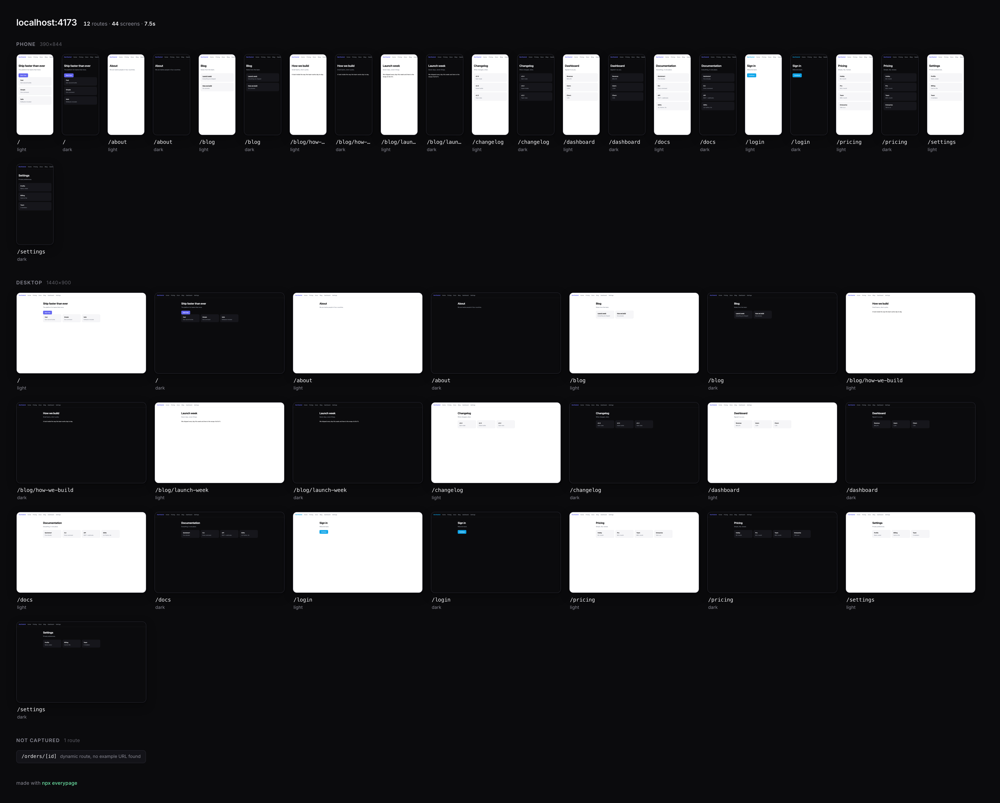

# everypage

**Every page of your app — phone and desktop, light and dark — as one image.**

```bash
npx everypage localhost:3000
```



That whole sheet took **7.5 seconds**. No config, no list of URLs, no test file. It found the routes by itself.

## Why

You built twelve pages over three weeks. You have never seen them next to each other, and you definitely never opened half of them on a phone. Neither has your agent — when Claude or Cursor wants to look at your app, it takes screenshots *one at a time*, burning a tool call and a thousand vision tokens per screen.

`everypage` shoots all of them at once and hands you a single image. Look at it yourself, then drag it into your agent and say **"make these consistent."**

## Install

```bash
npx everypage localhost:3000        # nothing to install
npm i -g everypage                  # or keep it around
```

First run downloads Chromium via Playwright if you don't have it.

## How it finds your pages

Three sources, merged, best first — so it works on a Next.js repo and on a URL you know nothing about:

1. **Your route files.** `app/**/page.tsx`, `pages/**`, `src/routes/**/+page.svelte`. Route groups like `app/(marketing)/about` resolve to `/about`; `/api` and `_internals` are skipped. This finds pages nothing links to yet.
2. **`sitemap.xml`**, if you serve one.
3. **Crawling your links**, two levels deep, same-origin only.

## The two things that ruin every tool like this

**Pages behind a login.** Without a session, half your app redirects and you get a sheet of identical login screens. everypage detects the redirect, tells you which routes hit it, and takes a session:

```bash
npx everypage localhost:3000 --auth ./session.json
```

```
✓ 36 screens in 7.7s
  2 pages redirected to a login (/dashboard, /settings)
  re-run with --auth <storageState.json> to shoot them as you
```

With the session: **44 screens**, dashboard and settings included. (`session.json` is a Playwright [storageState](https://playwright.dev/docs/auth) — save one once with `npx playwright codegen --save-storage=session.json`.)

**Dynamic routes.** `/orders/[id]` is not a URL — screenshotting it literally gives you a 404 in your sheet. everypage matches the template against real links found while crawling, so `/orders/[id]` becomes `/orders/42`. If it never sees a real one, the route appears in a **not captured** strip with the reason, instead of a fake tile:

```
NOT CAPTURED  3 routes
/dashboard  redirected to /login    /orders/[id]  dynamic route, no example URL found
```

A map with a labeled hole beats a map that quietly lies.

## Options

```
--devices phone,desktop     which sizes (phone, tablet, desktop)
--themes light,dark         which color schemes
--auth <state.json>         Playwright storageState — shoot private pages as you
--routes /a,/b              shoot exactly these, skip discovery
--project <dir>             where your code lives, for route files (default: cwd)
--out <dir>                 output directory (default: ./everypage)
--max <n>                   cap discovered routes (default: 40)
--full-page                 whole scroll height, not just the fold
--concurrency <n>           parallel browser contexts (default: 6)
--no-open                   don't open the sheet when it's done
```

You get `everypage/everypage.png` (the sheet) and `everypage/shots/` (every screenshot individually, named `route--device--theme.png`).

## For agents

The individual shots are plain files, and the sheet is one image. Instead of 44 screenshot tool calls, your agent reads one picture:

```
> drag everypage.png into Claude Code
"three of these have the wrong header, and /pricing is broken on mobile. fix them."
```

## Honest limits

- **Chromium only.** Safari and Firefox rendering differences aren't covered.
- **Client-rendered apps** get a fixed settle window (network-idle, then 220ms). Apps that stream forever still shoot, but may catch a spinner — `--full-page` and a warm dev server help.
- **Route discovery is best-effort.** Framework file conventions and links are what exist to read; a route reachable only through a form submission won't be found. `--routes` is the escape hatch.
- **Above the fold by default.** Tiles are uniform so the sheet stays legible; `--full-page` captures everything at the cost of a much taller image.
- Auth-walled and undiscoverable routes are listed, never silently dropped.

## Build

```bash
npm install && npm run build
npm test          # 15 tests
node demo-app/server.js &                       # a small app with a login wall
node dist/cli.js localhost:4173 --project demo-app
```

## License

MIT
